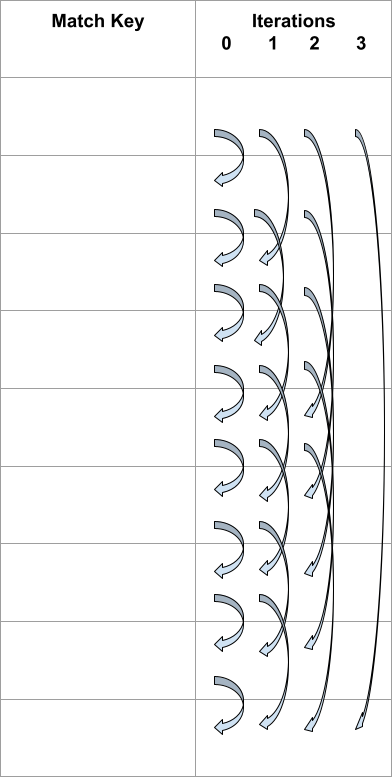

# IPA End to End Protocol

Erik Taubeneck ([@eriktaubeneck](https://github.com/eriktaubeneck)), Martin Thomson ([@martinthomson](https://github.com/martinthomson)), Benjamin Savage ([@benjaminsavage](https://github.com/benjaminsavage)), Benjamin Case ([@bmcase](https://github.com/bmcase)), Daniel Masny ([@danielmasny](https://github.com/danielmasny)), Richa Jain ([@richajaindce](https://github.com/richajaindce))

Originally posted on 2022/07/28.

# Overview

Interoperable Private Attribution (IPA) is a proposal for a new web platform API for advertising attribution. It does so by proposing two new user-agent APIs: 1) a `set_match_key()` API, and 2) a `get_encrypted_match_key()` API. The _match keys_ which leave the _user agent_ are always encrypted towards a _privacy preserving measurement_ system, i.e., a distributed multi-party computation (MPC) operated by _helper parties_ who are only trusted to not collude. The _helper parties_ that operate this privacy preserving measurement system participate in a protocol to produce an aggregate and differentially private attribution result. Our goal is that a web platform which implements this API only needs to trust the _helper parties_ to not collude in order to have assurance that the API does not enable cross-context tracking. (The PATCG is working on a threat model, and our goal is that IPA will satisfy that model.)

This document provides an end-to-end overview of that protocol, focusing primarily on the MPC performed by the _helper parties_. For exploring an MPC based approach, we have made several design choices in favor of simplicity. This is especially true for our approach to DP as well as the focus on _last touch attribution_. We intend to improve the functionality of IPA by adding other approaches to DP and attribution as IPA progresses.

## Table of Contents

* [IPA End to End Protocol](#ipa-end-to-end-protocol)
* [Overview](#overview)
  * [Table of Contents](#table-of-contents)
  * [Definitions](#definitions)
    * [Parties Involved](#parties-involved)
    * [Other Key Terms](#other-key-terms)
  * [Attribution Measurement](#attribution-measurement)
    * [Gathering Events](#gathering-events)
    * [Types of Queries](#types-of-queries)
  * [Overview of MPC Security Model](#overview-of-mpc-security-model)
  * [Differential Privacy](#differential-privacy)
    * [Differentially Private Aggregate Queries](#differentially-private-aggregate-queries)
    * [Differential Privacy Budget Management](#differential-privacy-budget-management)
* [Protocol](#protocol)
  * [Setup](#setup)
    * [Commitments](#commitments)
  * [Client Side: Setting the _match key_](#client-side-setting-the-match-key)
  * [Client Side: Getting the encrypted _match key_ report](#client-side-getting-the-encrypted-match-key-report)
  * [Constraints on encrypted _match keys_](#constraints-on-encrypted-match-keys)
  * [Clarifying allowed uses](#clarifying-allowed-uses)
  * [Additional Data](#additional-data)
    * [Additional data associated with _source reports_](#additional-data-associated-with-source-reports)
    * [Additional data associated with _trigger reports_](#additional-data-associated-with-trigger-reports)
  * [Generating _source_ and _trigger reports_ by the _report collector_](#generating-source-and-trigger-reports-by-the-report-collector)
  * [Secure Multi Party Computation between a _helper party network_ (P<sub>1</sub>, P<sub>2</sub>, P<sub>3</sub>)](#secure-multi-party-computation-between-a-helper-party-network-p1-p2-p3)
    * [Validating reports](#validating-reports)
    * [Oblivious _source_ and _trigger reports_](#oblivious-source-and-trigger-reports)
    * [Oblivious Sorting](#oblivious-sorting)
    * [Oblivious Last Touch Attribution](#oblivious-last-touch-attribution)
    * [User Level Sensitivity Capping](#user-level-sensitivity-capping)
    * [Computing the Aggregates](#computing-the-aggregates)
* [Technical Discussion and Remarks](#technical-discussion-and-remarks)
  * [Optimizations](#optimizations)
    * [Two Party Secret Sharing](#two-party-secret-sharing)
    * [_Match Key_ Compression](#match-key-compression)
    * [Presorting by Timestamp and Attribution Constraint ID](#presorting-by-timestamp-and-attribution-constraint-id)
    * [Computing the Aggregation for Large Amount of Breakdowns](#computing-the-aggregation-for-large-amount-of-breakdowns)
  * [Other Approaches to DP or MPC](#other-approaches-to-dp-or-mpc)
    * [Privacy Preserving Mean and Covariance Estimation](#privacy-preserving-mean-and-covariance-estimation)
  * [Transparency of Queries](#transparency-of-queries)
  * [Oblivious Algorithms](#oblivious-algorithms)
  * [Webviews and Embedded Browsers](#webviews-and-embedded-browsers)
    * [Applications that can access web content](#applications-that-can-access-web-content)
    * [Applications that cannot access web content](#applications-that-cannot-access-web-content)
* [Thanks and Acknowledgements](#thanks-and-acknowledgements)

## Definitions


### Parties Involved

There are a number of different parties that are involved with the protocol in one way or another:

1. _**User Agent**_: A piece of software used by an individual person.
2. _**User Agent Vendor**_: The distributor of the _user agent_.
3. _**Helper Party**:_ A party who participates in the MPC protocol.
4. _**Helper Party Network**_: A set of three _helper parties_. We aim to find _helper party networks_ which are trusted by _user agent vendors_ to be non-colluding.
5. _**Websites/apps**_: An individual _website_ (identified by its eTLD+1) or an individual _app_ (identified by the mechanism for the OS it operates on.)
6. _**Match key providers**)_: _Websites/apps_ which call the _set match key_ API, typically _websites/apps_ with a large logged-in set of users.
7. _**Source websites/apps**_: _Websites/apps_ on which a user produces a _source event_.
8. _**Trigger websites/apps**_: _Websites/apps_ on which a user produces a _trigger event_.
9. _**Report collectors**_: A specific _website/app_ or a _delegate_ acting on their behalf, that issues queries to the _helper party network_.
    1. _**Delegate report collectors**_: Service providers to whom _websites/apps_ delegate their query issuing. In the case where a service provider acts as a _delegate_ for two distinct _websites/apps_, we consider these two separate _report collectors_ for the purpose of this document.


### Other Key Terms

1. _**Fanout queries**_: The sets of queries that can be run by a _report collector_. A _fanout query_ must either be a _source fanout query_ or a _trigger fanout query_.
    1. _**Source fanout query**_: A query issued by a _report collector_ composed of _source reports_ from a single _source website/app_, which is the _website/app_ tied to that _report collector_. A _source fanout query_ may contain _trigger reports_ from many _trigger websites/apps_.
    2. _**Trigger fanout query**_: A query issued by a _report collector_ composed of _trigger reports_ from a single _trigger website/app_, which is the _website/app_ tied to that _report collector_. A _trigger fanout query_ may contain _source reports_ from many _source websites/apps_.
2. _**Epoch**_: a set period of time, e.g., a week.
3. _**Match key**_: An identifier, set in the _user agent_, which identifies an individual person. This must never be released (beyond the _match key provider_) to any party in unencrypted form.
4. _**Breakdown keys**_: A key, specified by the _report collector_, which allows for producing aggregates across many groups (or breakdowns.)
5. _**Attribution Constraint ID**_: An identifier, specified by the _report collector_, to denote if a given pair of _source_ and _trigger events_ can be attributed (beyond having the same _match key_.)


## Attribution Measurement

Attribution measurement is a basic measurement approach used in online digital advertising. For a given conversion event (e.g., a purchase), we aim to attribute that conversion to an ad impression (if one exists.) We generalize into _source events_ (i.e., an ad impression) and _trigger events_ (i.e., a purchase.) _Source events_ happen on a _source website/app_, and _trigger events_ happen on a _trigger website/app_. In order to attribute, a _source event_ must occur before the _trigger event_ and must be from the same individual. In the event that a single query contains _trigger events_ from multiple _trigger websites/apps_, we must also constrain the attribution to only attribute _trigger events_ to _source events_ from relevant campaigns.

There are various approaches to addressing the situation when a _trigger event_ can be attributed to multiple _source events_; for simplicity, in this document we currently only address _last touch attribution_, i.e., _trigger events_ are attributed to the most recent _source event_ (although it is feasible to extend this approach to more complex attribution approaches).

_Source and trigger events_ are represented by _source and trigger reports_ (more details in section [Generating source and trigger reports](#additional-data).) _Source reports_ include a _breakdown key_, which is used to identify the granularity of the attribution queries. Both _source_ and _trigger reports_ include an _attribution constraint ID_, for cases where _trigger events_ may not be eligible to attribute to all _source events_. The end result of attribution measurement is aggregates (counts and sums of values included with _trigger reports_), grouped by the _breakdown key_.

As a SQL query, we can approximate _last touch attribution_ as:

```sql
SELECT breakdown_key, SUM(value)
FROM (
    SELECT t.id,
           ANY(t.value) AS value,
           MAX_BY(s.breakdown_key, s.timestamp) AS breakdown_key
    FROM source_reports s
    JOIN trigger_reports t
    ON s.match_key = t.match_key
    WHERE s.timestamp < t.timestamp
    AND s.attribution_constraint_id = t.attribution_constraint_id
    GROUP BY t.id
)
GROUP BY breakdown_key;
```

### Gathering Events

IPA begins with different websites collecting information on important events.  Sites define what events are interesting to them.  Any information about that event can be collected along with the encrypted information produced by `get_encrypted_match_key()`.  At the time that an event is collected, IPA doesn't distinguish between _source events_ and _trigger events_.

These events will occur on different _websites/apps_, so they then need to be gathered together by a _report collector_ and assembled into a _fanout query_.  This means that _websites/apps_ -- or entities acting on their behalf, such as an agency, ad network, SSP, or DSP -- will need to coordinate the collection of events.

The bulk of the information that is collected for each event is chosen by the _website/app_ and is not passed to the _user agent_.  This information is not protected, so _websites/apps_ can choose what information they share about each event.


### Types of Queries

There are two types of queries which can be issued by a _report collector:_ a _source fanout query_ and _a trigger fanout query_. Both types take the same form as shown above in the SQL query, however a _source fanout query_ is composed of _source reports_ from a single _source website/app_, and _trigger reports_ from multiple _trigger websites/apps_. As such, the `attribution_constraint_id` is critical to _source fanout queries_, to ensure _trigger events_ are not spuriously attributed to _source events_ from unrelated campaigns.

Conversely, a _trigger fanout query_ is composed of _trigger reports_ from a single _trigger website/app_, and _source reports_ from multiple _source websites/apps_. When a _report collector_, acting on behalf of a specific _source_/_trigger websites/app_, issues a query, the query must either be a _source fanout query_ with _source reports_ from that _website/app_, or a _trigger fanout query_ with _trigger reports_ from that _website/app_.

When making a _fanout query_, the _report collector_ uses the information it receives about events to decide whether to include an event in the query and what value is attached to the event.  The _report collector_ also assigns a _breakdown key_ to each _source event_ and a _trigger value_ to each _trigger value_.  The _report collector_ also assigns a value of its choice for the _attribution constraint ID_ of all events.

Choosing which events are included and the values that are associated with each gives the _report collector_ the ability to make different queries from the same set of events, subject only to [differential privacy constraints](#differential-privacy-budget-management) on those queries.


## Overview of MPC Security Model

For the MPC run by a _helper party network_ we are proposing a 3-party, malicious, honest majority MPC such that even if one of the _helper parties_ actively tries to attack the protocol and runs malicious code to do so, they will be unable to learn any of the sensitive inputs and any actively malicious behavior will be detectable. We believe this will satisfy a threat model where we are trying to prevent any _helper party_ from leaking data in the event that they are curious, corrupted or compelled to do so.

With this being an honest majority MPC that does mean that if two of the three _helper parties_ in a _helper party network_ collude with each other the sensitive inputs can be leaked without detection. To mitigate this risk we propose the _helper party networks_ be carefully chosen (e.g., to protect against multiple _helper parties_ being compelled, they should be located in different jurisdictions unlikely to work together).

This three party, honest majority setting allows for very efficient MPC protocols that can achieve malicious security at only a reasonable cost over semi-honest security.


## Differential Privacy

In our current proposal, we have restricted ourselves to basic techniques to ensure differential privacy (DP). Our current approach favors simplicity, but we plan to continue researching ways to get better utility with the same privacy guarantee. Fundamentally, any approach to ensure DP is (in principle) compatible with MPC, but not every approach might be sufficiently efficient in an MPC.

We are using DP to ensure that for a specific period of time, an _epoch_ (e.g., a week,) the amount of information revealed about an individual person is bounded. Below, we describe how to achieve DP for an individual query, and then how to manage a privacy budget across queries over the course of an _epoch_.


### Differentially Private Aggregate Queries

In order to provide differential privacy, aggregate results have differentially private random noise added. Differential privacy is parameterized by ε (epsilon), which (inversely) scales the noise added to an aggregate output. The noise that is added needs to be proportional to the _sensitivity_, or the amount that inputs from an individual can influence the aggregate.

Adding more noise to an aggregate result can make the value less useful. A small ε means more noise and better privacy; a large ε means less noise and better utility. To ensure that noise is finite, the amount that each individual could contribute to the aggregate needs to be bounded. This bounding is done by sensitivity capping.


#### Sensitivity Capping

In order to provide differential privacy at the level of individual user contributions (as identified by _match keys_), each _match key_ must be limited in the total contribution it can make to the aggregate. This maximum contribution is the _sensitivity_ of the attribution function, and together with the ε, determines the amount of noise required to achieve differential privacy.

The sensitivity cap that is set for a query will be determined as a parameter to the query.  Any contribution that exceeds this cap for a single individual will be lost.  The exact value of what is lost due to this capping will be unknown to all entities involved - the _helper parties_ and the _report collector_. For example, a _report collector_ might set a maximum contribution of $100, but would be unaware how many users (if any) exceeded that cap and by how much the cap was exceeded.

Note that because individual contributions are capped, our protocol also provides _robustness_ against malicious inputs over that cap. In addition to provide privacy assurances, the sensitivity cap also limits the amount by which a malicious input can alter a result.


#### Differentially Private Noise

The output of each query is a sum per _breakdown key_. The contribution from a single user is limited across all breakdown keys, but this contribution can be allocated all to a single _breakdown key_ or distributed across multiple _breakdown keys_.  Consequently, the sensitivity of the value of each breakdown is determined by the global sensitivity cap.

Random noise is added to each breakdown, using ε and the _sensitivity_ to inform the variance of the noise distribution. Noise will be added to each breakdown sum to provide global DP. The exact noise distribution (Laplace, Gauss, ...) and method of application (in-MPC, by helpers, ...) has not yet been determined. This needs to consider the effect of the DP composition theorem, especially for multiple queries.


### Differential Privacy Budget Management

The previous section focuses on applying differential privacy to individual queries. However, we need to further design a system such that over an _epoch_, the amount of information released about people is bounded. Specifically, we propose that for a given _epoch_ and _website/app_ (represented by a single _report collector_), individuals (represented by _match keys_) can have a bounded impact on the results, as measured by ε differential privacy.

 In our current approach, we achieve this by providing each _report collector_ with a budget, ε for the given _website/app_ they are querying on behalf of. When _report collectors_ run queries they will specify how much budget to use, ε<sub>i</sub>, which will be deducted from their remaining budget. For example, given an _epoch_ limit of ε, a _report collector_ could perform 10 queries, each with global DP applied at ε/10, or a more complicated set of queries such as three with ε/5 and four with ε/10. (Note that smaller ε<sub>i</sub> result in _more_ noise and, thus, _more_ privacy.)

Each query will include both the budget, ε<sub>i</sub>, and the sensitivity cap, which together determine the amount of noise required for that query. There is a tradeoff between noise level and sensitivity cap: larger noise allows less sensitivity capping, i.e., larger values after the capping. The exact tradeoff between noise level and cap would be chosen by the _report collector_ according to how they want to use their budget. Statistically, this is a tradeoff between bias (introduced by the capping) and accuracy (decreased by the differentially private noise.)

The _helper party network_ will need to maintain this budget, per _website/app_, over the course of an _epoch_, preventing _report collectors_ from issuing additional queries once that budget is exhausted. At the beginning of the next _epoch_, every _report collector’s_ budget will refresh to ε. Note that in infinite time, the information revealed also goes to infinity; our aim here is to control how quickly that divergence happens.

The mechanism for enforcing that only a single _report collector_ can issue queries for a given _website/app_ is an open problem.

# Protocol


## Setup

Part of the protocol involves a _helper party network_ with three parties who the _user-agent vendor_ trusts to be non-colluding. We assume that the _user agent_ will be configured with the vendor approved _helper party networks_.

For each _helper party network_, some amount of setup needs to exist:


* The _helper parties_, P<sub>1</sub>, P<sub>2</sub>, P<sub>3</sub> each generate one public key, secret key pair, i.e., `(pk_1, sk_1)`, `(pk_2, sk_2)` and `(pk_3, sk_3)`, of an IND-CCA secure public key encryption.
    * We use `Encrypt(pk, data)` and `Decrypt(sk, data)` to denote its encryption and decryption under keys `(pk, sk)`.
* The public keys, i.e., `pk1`, `pk2` and `pk3`, are retrieved by the _user agents_. Each of the private keys is stored by exactly one of the _helper parties_.


### Commitments

Every _epoch, report collectors_ will need to make a commitment to use a specific _helper party network_ and _match key provider_. These commitments are important for enabling the differential privacy model we outline above; for a given _report collector_, a single _helper party network_ needs to manage its budget, and the commitment to a single _match key provider_ prevents duplicating user reports.

The mechanism for making such a commitment, and making sure that it’s visible to all _helper party networks_ is still an open problem.


## Client Side: Setting the _match key_

The first API proposed in IPA, `set_match_key()`, allows for the setting of a write-only `match_key` in the _user agent_ by _match key providers_. _Match key providers_ can be any _website/app_, but provide the most value when they are parties with large logged-in user bases, particularly across devices. As a user logs-in to a _match key provider_ service with different _user agents_ (across different browsers and apps, potentially on different devices) the _match key provider_ will set the same _match key_ for that user on each _user agent_.

The _match key_ cannot be read directly; it is only used to produce secret shares encrypted towards a specific _helper party network_.


## Client Side: Getting the encrypted _match key_ report

The second API proposed in IPA, `get_encrypted_match_key()`, allows _report collectors_ (acting on behalf of a specific _source_/_trigger website/app_) to request an encrypted _match key_.

This function requires three inputs: the _report collector_ (acting on behalf of a specific _source_/_trigger website/app_), the _match key provider_, and the _helper party network_. The _report collector_ will need to make a commitment to use the same _match key provider_ and _helper party network_ for the duration of an _epoch_, however this will be validated later by the _helper party network_ when the query is submitted.

To generate the encrypted _match key_, the _user agent_ will perform the following:


1. Look up in its local, private storage to see if a _match key_ from the _match key provider_ exists.
    1. If no _match key_ exists, it will generate a random local one, and store it.
2. Generate XOR secret shares of the _match key_, `match_key = mk_1 ^ mk_2 ^ mk_3`.
3. Generate the tuple `data_i = (mk_i, report_collector, current_website/app, match_key_provider)`.
4. Encrypt the data tuple under the public keys of the _helper party network_.
    2. `Encrypt(pk_1, data_1), Encrypt(pk_2, data_2), Encrypt(pk_3, data_3)`
5. These reports are provided back to the _report collector_ that called the API.


## Constraints on encrypted _match keys_

The key privacy property in generating the _encrypted match key_ is to prevent the _report collector_ from learning anything new about the user from the _user agent_. As a different secret sharing and encryption is used across the contexts of different _websites/apps_, _encrypted match keys_ cannot be used by the _report collector_ to enable cross-context tracking. Since an encrypted _match key_ is always returned upon request, the existence of a report reveals no new information to the _report collector_. Finally, since a random fallback value is used, a _report collector_ cannot learn even if the _match key_ was set.

An _encrypted match key_ is bound both to the _site_ that requested it and to the _epoch_ in which it was generated.  This prevents a site from misrepresenting where the _match key_ was generated and having it used for multiple queries.

But there is another key privacy property enabled by _match keys_, and that is capping the total contribution a single user can make to the aggregate output of an IPA query. As such, each _site_ (or the _report collector_ they delegate to) will need to make a commitment (for at least an _epoch_) to a specific _match key provider_, to prevent exceeding the intended privacy budget by leveraging multiple providers. What’s more, although a _match key_ provider can call `set_matchkey` at any time, any change they make will not be applied by the user agent until the start of the next _epoch_.

This implies that the user-agent need not generate a new secret-sharing and encryption of the _match key_ every time. If the `get_encrypted_match_key()` API is invoked multiple times, on the same _website/app_, for the same _report collector_ (and, implicitly, the same _match key provider_ and _helper party network_), the _user-agent_ can just return the same cached value. This will not reveal any cross-context information. The only exception would be if the user clears that _website/app_’s storage. In this case, a new secret-sharing and encryption will need to be generated in order to prevent re-identification across that clear.

Finally, to prevent a _report collector_ from circumventing their privacy budget by running duplicate queries, we need the _helper party network_ to enforce that a _report collector_, (acting on behalf of a specific _source_ or _trigger website app_) can only run _source_ or _trigger fanout queries_ related to that _website/app_. We can achieve this by having the _helper party network_ ensure that:

1. That they (the _helper party network_) are the _helper party network_ committed to by the _report collector_.
2. All provided encrypted _match keys_ are from the _match key provider_ committed to by the _report collector_.
3. That the current _source_ or _trigger fanout query_ only contains _source_ or _trigger reports_ (respectively) with a _match key_ generated on the _report collector’s_ associated _website/app_, which is recorded in the _current website/app_ field of the _data<sub>i</sub>_


## Clarifying allowed uses

It is possible for more than one _report collector_ to invoke the `get_encrypted_match_key()` API on the same _source_ or _trigger website/app_.

For example, `shoes.example` might buy ads on multiple _source websites/apps_. They would run _trigger fanout queries_ to measure the effectiveness of the ads they pay for across all source websites/apps. Each of those _source websites/apps_ would in turn like to receive _trigger reports_ from `shoes.example` for use in their own _source fanout queries_.

Suppose that `search.example` is one of those _source websites/apps_ where `shoes.example` buys ads. In order to obtain an encrypted _match key_ which could be used for `search.example`’s _source fanout queries_, the `get_encrypted_match_key` function will need to be invoked on the `shoes.example` site, specifying `search.example` as the _report collector_. In this example, `search.example` would either need to have a script embedded on `shoes.example`, or would need to coordinate with `shoes.example` to generate the events, as laid out in the next section.


## Additional Data

Let’s define the additional data a _report collector_ must generate for _source reports_ and _trigger reports_, beyond just the encrypted _match key_.


### Additional data associated with _source reports_

When a _source event_ occurs, a _report collector_ should also generate:

1. `timestamp`, the time of the event represented as a unix timestamp integer. The _report collector_ is responsible for deciding how to determine the time of the event.
2. `breakdown_key`, represented as an integer. A _breakdown key_ known at the time the ad was shown, which will be used to group the aggregated values.
3. `attribution_constraint_id` a value that a _source_ and _trigger report_ will also need to match to be attributed.


### Additional data associated with _trigger reports_

Similarly, when a _trigger event_ occurs, the _report collector_ should also generate:

1. `timestamp`, the time of the event represented as a unix timestamp integer. The _report collector_ is responsible for deciding how to determine the time of the event.
2. `trigger_value`, the value of the _trigger report_ to be aggregated.
3. `attribution_constraint_id` a value that a _source_ and _trigger report_ will also need to match to be attributed.


## Generating _source_ and _trigger reports_ by the _report collector_

When _source_ and _trigger events_ occur, the only information that must be prepared by the _user agent_ is the _encrypted match key_. All of the additional data listed above can be produced by the _report collector_ without the need for any newly designed APIs.

Next, the _report collector_ must produce _source_ and _trigger reports_ in a standard format that the _helper party network_ expects to receive. The following two structs provide that for the _source_ and _trigger reports_, respectively:

```
struct {
    tuple[Ciphertext] encrypted_match_key_shares;
    tuple[Ciphertext] encrypted_attribution_constraint_id;
    tuple[Ciphertext] encrypted_timestamp_shares;
    tuple[Ciphertext] encrypted_breakdown_key_shares;
} source_report

struct {
    tuple[Ciphertext] encrypted_match_key_shares;
    tuple[Ciphertext] encrypted_attribution_constraint_id;
    tuple[Ciphertext] encrypted_timestamp_shares;
    tuple[Ciphertext] encrypted_trigger_value;
} trigger_report
```

Aside from the encrypted _match key_ (which is already in the correct format), for each of the fields of these structs, the _report collector_ must do the following steps:

1. Generate a 3-way secret sharing: e.g., `v = v_1 + v_2 + v_3`
2. Encrypt each of the 3 shares towards one of the three _helper parties_: e.g., `Encrypt(pk_1, v_1), Encrypt(pk_2, v_2), Encrypt(pk_3, v_3)`

_Report collectors_ might choose to do this processing either client-side or server-side; either is acceptable. There are advantages and disadvantages associated with each approach.

From here, the _report collector_ is able to construct either a _source_ or _trigger fanout query_, which are limited to having _source reports_ or _trigger reports_, respectively, with _match keys_ only from the _website/app_ they are acting on behalf of. The _report collector_ issues that query by sending the collection of reports to the _helper party network_ which they are committed to.


## Secure Multi Party Computation between a _helper party network_ (P<sub>1</sub>, P<sub>2</sub>, P<sub>3</sub>)

To give a high level overview of what happens in the MPC:

1. First the _helper parties_ receive and decrypt their shares for _source_ or _trigger reports_.
    1. _Helper party<sub>j</sub>_ receives either a `source_report` or a `trigger_report`, and decrypts their shares of the attributes using `sk_j`.
    2. _Helper party<sub>j</sub>_ validates the report and builds a `generic_report` from their decrypted shares. [Section 2.8.1 Validating reports](#validating-reports) expands on the details.
2. The _helper parties_ supply these shares as private inputs into the MPC.
3. The _helper parties_ sort the _generic reports_ by `match_key`, `attribution_constraint_id`, then `timestamp`.
    1. We explore a handful of possible optimizations for this in section [Technical Discussion and Remarks](#technical-discussion-and-remarks).
4. The MPC also sets a secret shared helper bit to indicate if a row has the same `(match_key, attribution_constraint_id)` as the one before it.
    1. This could happen in a customized sorting protocol designed to also create these bits, or after the sort as a standalone step.
5. The MPC computes an _oblivious attribution_, a protocol we describe below that uses a tree-like pattern to obliviously attribute _trigger values_ to the nearest preceding _source report_ with the same _match key_.
6. The MPC enforces a sensitivity cap on the sum of _trigger values_ from a particular _match key_.
7. The MPC adds the `trigger_value` of the attributed _trigger report_ to the sum corresponding to the `breakdown_key `of the _source report_ to which it was attributed.
8. Using the sensitivity cap and the DP budget parameter, the MPC samples random noise and adds it to the sum corresponding to each _breakdown key_ to provide a global differential privacy guarantee.
9. For each _epoch_ (e.g., one week), the MPC helpers track the total budget consumed by each _report collector_, to limit the total information leakage from the system for each _epoch_ and _report collector_.

We now describe each step of the MPC in a bit more detail. Our MPC protocol relies heavily on the concept of _oblivious algorithms_, algorithms with access patterns that do not depend on their input. Oblivious algorithms allow for efficient MPC protocols, and we give more background in the section [Technical Discussion and Remarks](#technical-discussion-and-remarks). In the following, we discuss our current oblivious sorting and oblivious _last touch attribution_ approach.


### Validating reports

When each _helper party_ decrypts their share of the _match key data_, it also includes the _report collector_ who invoked `get_encrypted_match_key` along with the _website/app_ where it was invoked and the _match key provider_. The _helper party_ must validate a few items:

1. That the _report collector’s_ committed _helper party network_ is the currently running _helper party network_.
    1. This should be implicitly true, otherwise the _helper parties_ would be unable to decrypt the _encrypted match key data_.
2. That the _report collector’s_ committed _match key provider_ is the _match key provider_ specified in all decrypted _match key data._
3. That the _report collector_ issuing the query is the _report collector_ specified in all decrypted _match key data_.
4. That the query is either a _source fanout_ or _trigger fanout query_ for the _website/app_ that the _report collector_ is issuing the queries on behalf of. Explicitly, it is either:
    2. A _source fanout query_ where all _source reports_ have _match key data_ that was invoked on the _website/app_ that the _report collector_ is issuing the queries on behalf of, or
    3. A _trigger fanout query_ where all _trigger reports_ have _match key data_ that was invoked on the _website/app_ that the _report collector_ is issuing the queries on behalf of.


### Oblivious _source_ and _trigger reports_

In the MPC, _source_ and _trigger reports_ will need to be indistinguishable, so they will have the same format: _generic report_. This prevents information leakage by ensuring the _helper parties_ are unable to differentiate between _source_ and _trigger reports_ throughout the entire protocol. The _generic report shares_ (seen from the viewpoint of an individual _helper party_) uses the following struct:

```
struct {
    int match_key_share;
    int attribution_constraint_id_share;
    int timestamp_share;
    int is_trigger_report_share;
    int breakdown_key_share;
    int trigger_value_share;
} generic_report_share
```

_Source reports_ do not have any associated `trigger_value`, and _trigger reports_ do not have any associated `breakdown_key`, so for these each _helper party_ can just set their share to zero. Additionally, each _helper party_ will initially know which reports are _source reports_ and which are _trigger reports_, and set the `is_trigger_report` accordingly. Without loss of generality, we can assign _helper party<sub>1</sub>_ to set the value of `is_trigger_report` to 1 for _trigger reports_, and all other _helper parties_ set the value to 0. (All _helper parties_ set the value to 0 for _source reports_.)

In the next step, the values will be obliviously sorted, which reorders the events and re-randomizes all of these secret shares in such a way that each row is indistinguishable from any other, and unlinkable to their original position. At this point, due to the structure of the `generic_report`, _source reports_ and _trigger reports_ are indistinguishable.

### Oblivious Sorting

The first step of the MPC is to sort the reports by the _match key_, then timestamp. This sort must be oblivious, i.e., it cannot reveal (even to the _helper parties_) the sorted location of any report. As such, the sorting must also involve re-sharing the secret shares of all the data in the report (to prevent the _helper parties_ from linking the input rows to the output rows). For better readability, we give some examples in the clear, i.e., not secret shared. We emphasize that all the following lists would be secret shared among the _helper parties_ and no party would have access to the data in the clear. The sorted list has the following format:

<table>
  <tr>
   <td colspan="7" ><strong>Example Data In the Clear (Would be secret shared in MPC)</strong>
   </td>
  </tr>
  <tr>
   <td><strong>Match Key</strong>
   </td>
   <td><strong>Attribution Constraint</strong>
   </td>
   <td><strong>Timestamp</strong>
   </td>
   <td><strong>Helper Bit</strong>
   </td>
   <td><strong>Trigger Bit</strong>
   </td>
   <td><strong>Breakdown Key</strong>
   </td>
   <td><strong>Purchase Value</strong>
   </td>
  </tr>
  <tr>
   <td>1454
   </td>
   <td>53
   </td>
   <td>1:07
   </td>
   <td>0
   </td>
   <td>0
   </td>
   <td>2
   </td>
   <td>0
   </td>
  </tr>
  <tr>
   <td>1454
   </td>
   <td>53
   </td>
   <td>1:27
   </td>
   <td>1
   </td>
   <td>0
   </td>
   <td>3
   </td>
   <td>0
   </td>
  </tr>
  <tr>
   <td>1454
   </td>
   <td>53
   </td>
   <td>3:46
   </td>
   <td>1
   </td>
   <td>1
   </td>
   <td>-1
   </td>
   <td>250
   </td>
  </tr>
  <tr>
   <td>1454
   </td>
   <td>53
   </td>
   <td>4:12
   </td>
   <td>1
   </td>
   <td>1
   </td>
   <td>-1
   </td>
   <td>25
   </td>
  </tr>
  <tr>
   <td>1454
   </td>
   <td>53
   </td>
   <td>4:39
   </td>
   <td>1
   </td>
   <td>1
   </td>
   <td>-1
   </td>
   <td>20
   </td>
  </tr>
  <tr>
   <td>1454
   </td>
   <td>72
   </td>
   <td>5:52
   </td>
   <td>0
   </td>
   <td>1
   </td>
   <td>-1
   </td>
   <td>130
   </td>
  </tr>
  <tr>
   <td>1454
   </td>
   <td>72
   </td>
   <td>7:48
   </td>
   <td>1
   </td>
   <td>1
   </td>
   <td>-1
   </td>
   <td>50
   </td>
  </tr>
  <tr>
   <td>5422
   </td>
   <td>53
   </td>
   <td>3:24
   </td>
   <td>0
   </td>
   <td>0
   </td>
   <td>0
   </td>
   <td>0
   </td>
  </tr>
  <tr>
   <td>9086
   </td>
   <td>14
   </td>
   <td>2:56
   </td>
   <td>0
   </td>
   <td>1
   </td>
   <td>-1
   </td>
   <td>100
   </td>
  </tr>
</table>


As mentioned above, the _helper bit_ indicates if the preceding row has the same `(match_key, attribution_constraint_id)` as the current element. We also may benefit from simply concatenating `match_key` and `attribution_constraint_id` together. We are exploring protocols to generate this helper bit during the sorting, and ultimately it’s an optimization to prevent a more expensive equality check between two rows in the attribution step (next.) We are actively researching which sorting algorithm will be best to use here, particularly in combination with creating the helper bit.


### Oblivious Last Touch Attribution

In this section, we describe our oblivious algorithm for _last touch attribution_. As mentioned earlier, we constrain ourselves within this document to _last touch attribution_ for the sake of simplicity. We aim to extend the IPA attribution functionality in the future to other attribution heuristics, such as equal credit.

Our oblivious attribution algorithm operates on the sorted list of secret-shared values (described above) and has O(log N) iterations where N is the list size. During each of the iterations, `i = [0, log_2(N))`, each row is compared to the row `2^i` below it in the list. This approach establishes a tree-like structure in which starting from the leaf nodes, each node accesses and accumulates data of its children. By increasing the distance between the interacting nodes during each iteration by a factor of two, we ensure that each node only accumulates the value of each successor only once. We stop accumulating data when `(match_key, attribution_constraint_id)` are not equal, as indicated by the helper bit.

We must perform all iterations even if all nodes have already stopped accumulating data, because stopping early would reveal information (making it a non-oblivious algorithm.) Note that we could optimize this to a fixed, but less than `log(N)`, number of iterations, if we believe that _match keys_ will only have at most `2^i` reports in a given query.


#### Interaction Pattern

In each iteration of the oblivious _last touch attribution_, each row is only compared with one other row in the list, which makes it highly parallelizable. The following image shows this interaction pattern over the course of 4 iterations.




This interaction pattern is oblivious because it does not depend on the values of the _match keys_. Further, it allows for accumulation of data across all successors, which can be modeled as a tree with nodes. For example, if we think of the first row as a tree, we can accumulate the following 8 rows in only 4 iterations:


#### _Last Touch Attribution_

We are adding two additional variables that will help us to accumulate the _last touch attribution_. One is a stop bit that will indicate whether the current row has stopped accumulating credit. It will be initialized to 1, and will stop accumulating credit once it is updated to 0. The other one is the credit variable that stores the accumulated credit. For _trigger reports_, we initialize the credit with its purchase value, and use -1 for the _breakdown key_ (since it’s unused). The list has the following format:

<table>
  <tr>
   <td colspan="9" ><strong>Example Data In the Clear (Would be secret shared in MPC)</strong>
   </td>
  </tr>
  <tr>
   <td><strong>Match Key</strong>
   </td>
   <td><strong>Attribution Constraint</strong>
   </td>
   <td><strong>Timestamp</strong>
   </td>
   <td><strong>Helper Bit</strong>
   </td>
   <td><strong>Trigger Bit</strong>
   </td>
   <td><strong>Stop Bit</strong>
   </td>
   <td><strong>Breakdown Key</strong>
   </td>
   <td><strong>Purchase Value</strong>
   </td>
   <td><strong>Credit</strong>
   </td>
  </tr>
  <tr>
   <td>1454
   </td>
   <td>53
   </td>
   <td>1:07
   </td>
   <td>0
   </td>
   <td>0
   </td>
   <td>1
   </td>
   <td>2
   </td>
   <td>0
   </td>
   <td>0
   </td>
  </tr>
  <tr>
   <td>1454
   </td>
   <td>53
   </td>
   <td>1:27
   </td>
   <td>1
   </td>
   <td>0
   </td>
   <td>1
   </td>
   <td>3
   </td>
   <td>0
   </td>
   <td>0
   </td>
  </tr>
  <tr>
   <td>1454
   </td>
   <td>53
   </td>
   <td>3:46
   </td>
   <td>1
   </td>
   <td>1
   </td>
   <td>1
   </td>
   <td>-1
   </td>
   <td>250
   </td>
   <td>250
   </td>
  </tr>
  <tr>
   <td>1454
   </td>
   <td>53
   </td>
   <td>4:12
   </td>
   <td>1
   </td>
   <td>1
   </td>
   <td>1
   </td>
   <td>-1
   </td>
   <td>25
   </td>
   <td>25
   </td>
  </tr>
  <tr>
   <td>1454
   </td>
   <td>53
   </td>
   <td>4:39
   </td>
   <td>1
   </td>
   <td>1
   </td>
   <td>1
   </td>
   <td>-1
   </td>
   <td>20
   </td>
   <td>20
   </td>
  </tr>
  <tr>
   <td>1454
   </td>
   <td>72
   </td>
   <td>5:52
   </td>
   <td>0
   </td>
   <td>1
   </td>
   <td>1
   </td>
   <td>-1
   </td>
   <td>130
   </td>
   <td>130
   </td>
  </tr>
  <tr>
   <td>1454
   </td>
   <td>72
   </td>
   <td>7:48
   </td>
   <td>1
   </td>
   <td>1
   </td>
   <td>1
   </td>
   <td>-1
   </td>
   <td>50
   </td>
   <td>50
   </td>
  </tr>
  <tr>
   <td>5422
   </td>
   <td>53
   </td>
   <td>3:24
   </td>
   <td>0
   </td>
   <td>0
   </td>
   <td>1
   </td>
   <td>0
   </td>
   <td>0
   </td>
   <td>0
   </td>
  </tr>
  <tr>
   <td>9086
   </td>
   <td>14
   </td>
   <td>2:56
   </td>
   <td>0
   </td>
   <td>1
   </td>
   <td>1
   </td>
   <td>-1
   </td>
   <td>100
   </td>
   <td>100
   </td>
  </tr>
</table>

Using the oblivious access pattern, we can implement _last touch attribution_ using the following logic that is executed for each row. We use `current` for the current row, and `successor` for the row `2^i` below.

```
if (stop_bit == 1 and successor.helper_bit = 1 and successor.trigger_bit == 1):
    credit += successor.credit
    stop_bit = successor.stop_bit
else:
    stop_bit = 0
```

**MPC Optimization for Last Touch. **We can improve the efficiency of the last touch logic by not using branching logic and replacing the `if/else` form in the above code with arithmetic operations. Fortunately, we can easily represent the logic of the _last touch attribution_ as arithmetic operations, as follows:

```
flag = current.stop_bit * successor.helper_bit * successor.trigger_bit
current.credit = current.credit + flag * successor.credit
current.stop_bit = flag * successor.stop_bit
```

We can further optimize this by not computing it fresh every step, but storing it explicitly on the list and updating it.

Using this logic during each iteration for each row, we obtain the following intermediate results for our example list.

In **iteration 0**, each row is compared to the next row (i.e., `index + 1 == index + 2^0`) to update the Stop Bit and Credit columns. Values that change from the previous round are highlighted in **bold**.


<table>
  <tr>
   <td colspan="12" ><strong>Example Data In the Clear (Would be secret shared in MPC)</strong>
   </td>
  </tr>
  <tr>
   <td><strong>Match Key</strong>
   </td>
   <td><strong>Attribution Constraint</strong>
   </td>
   <td><strong>Timestamp</strong>
   </td>
   <td><strong>Helper Bit</strong>
   </td>
   <td><strong>Trigger Bit</strong>
   </td>
   <td><strong>Stop Bit</strong>
   </td>
   <td><strong>Breakdown Key</strong>
   </td>
   <td><strong>Purchase Value</strong>
   </td>
   <td><strong>Credit</strong>
   </td>
   <td rowspan="10" >
   </td>
   <td><strong>Updated Stop Bit</strong>
<p>
(Helper Bit[+1] & Trigger Bit[+1] & Stop Bit)
   </td>
   <td><strong>Updated Credit</strong>
<p>
Credit + Credit[+1] * (Updated Stop Bit)
   </td>
  </tr>
  <tr>
   <td>1454
   </td>
   <td>53
   </td>
   <td>1:07
   </td>
   <td>0
   </td>
   <td>0
   </td>
   <td>1
   </td>
   <td>2
   </td>
   <td>0
   </td>
   <td>0
   </td>
   <td>(1 & 0 & 1) = <strong>0</strong>
   </td>
   <td>0 + 0*0 = 0
   </td>
  </tr>
  <tr>
   <td>1454
   </td>
   <td>53
   </td>
   <td>1:27
   </td>
   <td>1
   </td>
   <td>0
   </td>
   <td>1
   </td>
   <td>3
   </td>
   <td>0
   </td>
   <td>0
   </td>
   <td>(1 & 1 & 1) = 1
   </td>
   <td>0 + 1*250 = <strong>250</strong>
   </td>
  </tr>
  <tr>
   <td>1454
   </td>
   <td>53
   </td>
   <td>3:46
   </td>
   <td>1
   </td>
   <td>1
   </td>
   <td>1
   </td>
   <td>-1
   </td>
   <td>250
   </td>
   <td>250
   </td>
   <td>(1 & 1 & 1) = 1
   </td>
   <td>250 + 1*25 = <strong>275</strong>
   </td>
  </tr>
  <tr>
   <td>1454
   </td>
   <td>53
   </td>
   <td>4:12
   </td>
   <td>1
   </td>
   <td>1
   </td>
   <td>1
   </td>
   <td>-1
   </td>
   <td>25
   </td>
   <td>25
   </td>
   <td>(1 & 1 & 1) = 1
   </td>
   <td>25 + 1*20 = <strong>45</strong>
   </td>
  </tr>
  <tr>
   <td>1454
   </td>
   <td>53
   </td>
   <td>4:39
   </td>
   <td>1
   </td>
   <td>1
   </td>
   <td>1
   </td>
   <td>-1
   </td>
   <td>20
   </td>
   <td>20
   </td>
   <td>(0 & 1 & 1) = <strong>0</strong>
   </td>
   <td>20 + 0*130 = 20
   </td>
  </tr>
  <tr>
   <td>1454
   </td>
   <td>72
   </td>
   <td>5:52
   </td>
   <td>0
   </td>
   <td>1
   </td>
   <td>1
   </td>
   <td>-1
   </td>
   <td>130
   </td>
   <td>130
   </td>
   <td>(1 & 1 & 1) = 1
   </td>
   <td>130 + 1*50 = <strong>180</strong>
   </td>
  </tr>
  <tr>
   <td>1454
   </td>
   <td>72
   </td>
   <td>7:48
   </td>
   <td>1
   </td>
   <td>1
   </td>
   <td>1
   </td>
   <td>-1
   </td>
   <td>50
   </td>
   <td>50
   </td>
   <td>(0 & 0 & 1) = <strong>0</strong>
   </td>
   <td>50 + 0*0 = 50
   </td>
  </tr>
  <tr>
   <td>5422
   </td>
   <td>53
   </td>
   <td>3:24
   </td>
   <td>0
   </td>
   <td>0
   </td>
   <td>1
   </td>
   <td>0
   </td>
   <td>0
   </td>
   <td>0
   </td>
   <td>(0 & 1 & 1) = <strong>0</strong>
   </td>
   <td>0 + 0*100 = 0
   </td>
  </tr>
  <tr>
   <td>9086
   </td>
   <td>14
   </td>
   <td>2:56
   </td>
   <td>0
   </td>
   <td>1
   </td>
   <td>1
   </td>
   <td>-1
   </td>
   <td>100
   </td>
   <td>100
   </td>
   <td>(No successor) = <strong>0</strong>
   </td>
   <td>100
   </td>
  </tr>
</table>

In **iteration 1**, each row is compared to the row 2 below (i.e., `index + 2^1 == index + 2`)

<table>
  <tr>
   <td colspan="12" ><strong>Example Data In the Clear (Would be secret shared in MPC)</strong>
   </td>
  </tr>
  <tr>
   <td><strong>Match Key</strong>
   </td>
   <td><strong>Attribution Constraint</strong>
   </td>
   <td><strong>Timestamp</strong>
   </td>
   <td><strong>Helper Bit</strong>
   </td>
   <td><strong>Trigger Bit</strong>
   </td>
   <td><strong>Stop Bit</strong>
   </td>
   <td><strong>Breakdown Key</strong>
   </td>
   <td><strong>Purchase Value</strong>
   </td>
   <td><strong>Credit</strong>
   </td>
   <td rowspan="10" >
   </td>
   <td><strong>Updated Stop Bit</strong>
<p>
(Helper Bit[+2] & Trigger Bit[+2] & Stop Bit)
   </td>
   <td><strong>Updated Credit</strong>
<p>
Credit + Credit[+2] * (Updated Stop Bit)
   </td>
  </tr>
  <tr>
   <td>1454
   </td>
   <td>53
   </td>
   <td>1:07
   </td>
   <td>0
   </td>
   <td>0
   </td>
   <td><strong>0</strong>
   </td>
   <td>2
   </td>
   <td>0
   </td>
   <td>0
   </td>
   <td>(1 & 1 & 0) = 0
   </td>
   <td>0 + 0*275 = 0
   </td>
  </tr>
  <tr>
   <td>1454
   </td>
   <td>53
   </td>
   <td>1:27
   </td>
   <td>1
   </td>
   <td>0
   </td>
   <td>1
   </td>
   <td>3
   </td>
   <td>0
   </td>
   <td><strong>250</strong>
   </td>
   <td>(1 & 1 & 1) = 1
   </td>
   <td>250 + 1*45 = <strong>295</strong>
   </td>
  </tr>
  <tr>
   <td>1454
   </td>
   <td>53
   </td>
   <td>3:46
   </td>
   <td>1
   </td>
   <td>1
   </td>
   <td>1
   </td>
   <td>-1
   </td>
   <td>250
   </td>
   <td><strong>275</strong>
   </td>
   <td>(1 & 1 & 1) = 1
   </td>
   <td>275 + 1*20 = <strong>295</strong>
   </td>
  </tr>
  <tr>
   <td>1454
   </td>
   <td>53
   </td>
   <td>4:12
   </td>
   <td>1
   </td>
   <td>1
   </td>
   <td>1
   </td>
   <td>-1
   </td>
   <td>25
   </td>
   <td><strong>45</strong>
   </td>
   <td>(0 & 1 & 1) = <strong>0</strong>
   </td>
   <td>45 + 0*180 = 45
   </td>
  </tr>
  <tr>
   <td>1454
   </td>
   <td>53
   </td>
   <td>4:39
   </td>
   <td>1
   </td>
   <td>1
   </td>
   <td><strong>0</strong>
   </td>
   <td>-1
   </td>
   <td>20
   </td>
   <td>20
   </td>
   <td>(1 & 1 & 0) 0
   </td>
   <td>20 + 0*50 = 20
   </td>
  </tr>
  <tr>
   <td>1454
   </td>
   <td>72
   </td>
   <td>5:52
   </td>
   <td>0
   </td>
   <td>1
   </td>
   <td><strong>1</strong>
   </td>
   <td>-1
   </td>
   <td>130
   </td>
   <td><strong>180</strong>
   </td>
   <td>(0 & 0 & 1) = <strong>0</strong>
   </td>
   <td>180 + 0*0 = 180
   </td>
  </tr>
  <tr>
   <td>1454
   </td>
   <td>72
   </td>
   <td>7:48
   </td>
   <td>1
   </td>
   <td>1
   </td>
   <td><strong>0</strong>
   </td>
   <td>-1
   </td>
   <td>50
   </td>
   <td>50
   </td>
   <td>(0 & 1 & 0) = 0
   </td>
   <td>50 + 0*100 = 50
   </td>
  </tr>
  <tr>
   <td>5422
   </td>
   <td>53
   </td>
   <td>3:24
   </td>
   <td>0
   </td>
   <td>0
   </td>
   <td><strong>0</strong>
   </td>
   <td>0
   </td>
   <td>0
   </td>
   <td>0
   </td>
   <td>(No successor) = 0
   </td>
   <td>0
   </td>
  </tr>
  <tr>
   <td>9086
   </td>
   <td>14
   </td>
   <td>2:56
   </td>
   <td>0
   </td>
   <td>1
   </td>
   <td><strong>0</strong>
   </td>
   <td>-1
   </td>
   <td>100
   </td>
   <td>100
   </td>
   <td>(No successor) = 0
   </td>
   <td>100
   </td>
  </tr>
</table>


In **iteration 2**, each row is compared to the row 4 below (i.e., `index + 2^2 == index + 4):


<table>
  <tr>
   <td colspan="12" ><strong>Example Data In the Clear (Would be secret shared in MPC)</strong>
   </td>
  </tr>
  <tr>
   <td><strong>Match Key</strong>
   </td>
   <td><strong>Attribution Constraint</strong>
   </td>
   <td><strong>Timestamp</strong>
   </td>
   <td><strong>Helper Bit</strong>
   </td>
   <td><strong>Trigger Bit</strong>
   </td>
   <td><strong>Stop Bit</strong>
   </td>
   <td><strong>Breakdown Key</strong>
   </td>
   <td><strong>Purchase Value</strong>
   </td>
   <td><strong>Credit</strong>
   </td>
   <td rowspan="10" >
   </td>
   <td><strong>Updated Stop Bit</strong>
<p>
(Helper Bit[+4] & Trigger Bit[+4] & Stop Bit)
   </td>
   <td><strong>Updated Credit</strong>
<p>
Credit + Credit[+4] * (Updated Stop Bit)
   </td>
  </tr>
  <tr>
   <td>1454
   </td>
   <td>53
   </td>
   <td>1:07
   </td>
   <td>0
   </td>
   <td>0
   </td>
   <td>0
   </td>
   <td>2
   </td>
   <td>0
   </td>
   <td>0
   </td>
   <td>(1 & 1 & 0) = 0
   </td>
   <td>0 + 0*20 = 0
   </td>
  </tr>
  <tr>
   <td>1454
   </td>
   <td>53
   </td>
   <td>1:27
   </td>
   <td>1
   </td>
   <td>0
   </td>
   <td>1
   </td>
   <td>3
   </td>
   <td>0
   </td>
   <td><strong>295</strong>
   </td>
   <td>(0 & 1 & 1) = 0
   </td>
   <td>295 + 0*180 = 295
   </td>
  </tr>
  <tr>
   <td>1454
   </td>
   <td>53
   </td>
   <td>3:46
   </td>
   <td>1
   </td>
   <td>1
   </td>
   <td>1
   </td>
   <td>-1
   </td>
   <td>250
   </td>
   <td><strong>295</strong>
   </td>
   <td>(1 & 1 & 1) = 1
   </td>
   <td>295 + 1*50 = <strong>345</strong>
   </td>
  </tr>
  <tr>
   <td>1454
   </td>
   <td>53
   </td>
   <td>4:12
   </td>
   <td>1
   </td>
   <td>1
   </td>
   <td><strong>0</strong>
   </td>
   <td>-1
   </td>
   <td>25
   </td>
   <td>45
   </td>
   <td>(0 & 0 & 0) = 0
   </td>
   <td>45 + 0*0 = 45
   </td>
  </tr>
  <tr>
   <td>1454
   </td>
   <td>53
   </td>
   <td>4:39
   </td>
   <td>1
   </td>
   <td>1
   </td>
   <td>0
   </td>
   <td>-1
   </td>
   <td>20
   </td>
   <td>20
   </td>
   <td>(0 & 1 & 0) = 0
   </td>
   <td>20 + 0*100 = 20
   </td>
  </tr>
  <tr>
   <td>1454
   </td>
   <td>72
   </td>
   <td>5:52
   </td>
   <td>0
   </td>
   <td>1
   </td>
   <td><strong>0</strong>
   </td>
   <td>-1
   </td>
   <td>130
   </td>
   <td>180
   </td>
   <td>(No successor) = 0
   </td>
   <td>180
   </td>
  </tr>
  <tr>
   <td>1454
   </td>
   <td>72
   </td>
   <td>7:48
   </td>
   <td>1
   </td>
   <td>1
   </td>
   <td>0
   </td>
   <td>-1
   </td>
   <td>50
   </td>
   <td>50
   </td>
   <td>(No successor) = 0
   </td>
   <td>50
   </td>
  </tr>
  <tr>
   <td>5422
   </td>
   <td>53
   </td>
   <td>3:24
   </td>
   <td>0
   </td>
   <td>0
   </td>
   <td>0
   </td>
   <td>0
   </td>
   <td>0
   </td>
   <td>0
   </td>
   <td>(No successor) = 0
   </td>
   <td>0
   </td>
  </tr>
  <tr>
   <td>9086
   </td>
   <td>14
   </td>
   <td>2:56
   </td>
   <td>0
   </td>
   <td>1
   </td>
   <td>0
   </td>
   <td>-1
   </td>
   <td>100
   </td>
   <td>100
   </td>
   <td>(No successor) = 0
   </td>
   <td>100
   </td>
  </tr>
</table>


In **iteration 3**, each row is compared to the row 8 below it (i.e., `index + 2^3 == index + 8`.) This is our final iteration, because the largest gap in our sample dataset is 8.


<table>
  <tr>
   <td colspan="12" ><strong>Example Data In the Clear (Would be secret shared in MPC)</strong>
   </td>
  </tr>
  <tr>
   <td><strong>Match Key</strong>
   </td>
   <td><strong>Attribution Constraint</strong>
   </td>
   <td><strong>Timestamp</strong>
   </td>
   <td><strong>Helper Bit</strong>
   </td>
   <td><strong>Trigger Bit</strong>
   </td>
   <td><strong>Stop Bit</strong>
   </td>
   <td><strong>Breakdown Key</strong>
   </td>
   <td><strong>Purchase Value</strong>
   </td>
   <td><strong>Credit</strong>
   </td>
   <td rowspan="10" >
   </td>
   <td><strong>Updated Stop Bit</strong>
<p>
(Helper Bit[+4] & Trigger Bit[+4] & Stop Bit)
   </td>
   <td><strong>Updated Credit</strong>
<p>
Credit + Credit[+4] * (Updated Stop Bit)
   </td>
  </tr>
  <tr>
   <td>1454
   </td>
   <td>53
   </td>
   <td>1:07
   </td>
   <td>0
   </td>
   <td>0
   </td>
   <td>0
   </td>
   <td>2
   </td>
   <td>0
   </td>
   <td>0
   </td>
   <td>(0 & 1 & 0) = 0
   </td>
   <td>0 + 0*100 = 0
   </td>
  </tr>
  <tr>
   <td>1454
   </td>
   <td>53
   </td>
   <td>1:27
   </td>
   <td>1
   </td>
   <td>0
   </td>
   <td><strong>0</strong>
   </td>
   <td>3
   </td>
   <td>0
   </td>
   <td>295
   </td>
   <td>(No successor) = <strong>0</strong>
   </td>
   <td>295
   </td>
  </tr>
  <tr>
   <td>1454
   </td>
   <td>53
   </td>
   <td>3:46
   </td>
   <td>1
   </td>
   <td>1
   </td>
   <td>1
   </td>
   <td>-1
   </td>
   <td>250
   </td>
   <td><strong>345</strong>
   </td>
   <td>(No successor) = 0
   </td>
   <td>345
   </td>
  </tr>
  <tr>
   <td>1454
   </td>
   <td>53
   </td>
   <td>4:12
   </td>
   <td>1
   </td>
   <td>1
   </td>
   <td>0
   </td>
   <td>-1
   </td>
   <td>25
   </td>
   <td>45
   </td>
   <td>(No successor) = 0
   </td>
   <td>45
   </td>
  </tr>
  <tr>
   <td>1454
   </td>
   <td>53
   </td>
   <td>4:39
   </td>
   <td>1
   </td>
   <td>1
   </td>
   <td>0
   </td>
   <td>-1
   </td>
   <td>20
   </td>
   <td>20
   </td>
   <td>(No successor) = 0
   </td>
   <td>20
   </td>
  </tr>
  <tr>
   <td>1454
   </td>
   <td>72
   </td>
   <td>5:52
   </td>
   <td>0
   </td>
   <td>1
   </td>
   <td>0
   </td>
   <td>-1
   </td>
   <td>130
   </td>
   <td>180
   </td>
   <td>(No successor) = 0
   </td>
   <td>180
   </td>
  </tr>
  <tr>
   <td>1454
   </td>
   <td>72
   </td>
   <td>7:48
   </td>
   <td>1
   </td>
   <td>1
   </td>
   <td>0
   </td>
   <td>-1
   </td>
   <td>50
   </td>
   <td>50
   </td>
   <td>(No successor) = 0
   </td>
   <td>50
   </td>
  </tr>
  <tr>
   <td>5422
   </td>
   <td>53
   </td>
   <td>3:24
   </td>
   <td>0
   </td>
   <td>0
   </td>
   <td>0
   </td>
   <td>0
   </td>
   <td>0
   </td>
   <td>0
   </td>
   <td>(No successor) = 0
   </td>
   <td>0
   </td>
  </tr>
  <tr>
   <td>9086
   </td>
   <td>14
   </td>
   <td>2:56
   </td>
   <td>0
   </td>
   <td>1
   </td>
   <td>0
   </td>
   <td>-1
   </td>
   <td>100
   </td>
   <td>100
   </td>
   <td>(No successor) = 0
   </td>
   <td>100
   </td>
  </tr>
</table>


Note that there is no change after the 4th iteration, but since the helpers can only see secret shares, they are not aware that this is unchanged. In fact, this is the point of an oblivious algorithm; if the algorithm were to stop after iteration 3, it would leak unintended information (outside of the intended purpose constrained output.)


### User Level Sensitivity Capping

We’ve now outlined an algorithm for oblivious attribution, but in order to ensure differential privacy, we need to limit the overall contribution that an individual user (as defined by a _match key_) can make to the entire query. More specifically, we ensure that for each _match key_ the sum of all attributed _trigger values_ does not exceed some bound. When a _match key_’s sum of attributed _trigger values_ does exceed this bound, we need to reduce them in some way. One approach is to reduce all contributions proportionally, e.g., if the cap is 100 but a _match key_ contributes 300, all contributions made by that _match key_ are reduced to a third of their value.


### Computing the Aggregates

After the final iteration, we can then sum up the credit for each _breakdown key_ by iterating through the list. Note that we ignore the -1 value, which we used as a dummy value for the trigger events.


<table>
  <tr>
   <td colspan="2" ><strong>Example Data In the Clear (Would be secret shared in MPC)</strong>
   </td>
  </tr>
  <tr>
   <td><strong>Breakdown Key</strong>
   </td>
   <td><strong>Credit</strong>
   </td>
  </tr>
  <tr>
   <td>0
   </td>
   <td>0
   </td>
  </tr>
  <tr>
   <td>1
   </td>
   <td>0
   </td>
  </tr>
  <tr>
   <td>2
   </td>
   <td>0
   </td>
  </tr>
  <tr>
   <td>3
   </td>
   <td>295
   </td>
  </tr>
</table>

#### DP Noise Addition

After computing the aggregates within each category, the _helper parties_ P<sub>1</sub>, P<sub>2</sub>, P<sub>3</sub> generate additive noise to ensure DP on the user level. The amount of noise added depends on the sensitivity, i.e., on the cap of how much an individual _match key_ owner can contribute.

The noise is generated within an MPC protocol. This could be done by having each party sample noise independently then add it to the secret shared aggregated value. This is a simple approach but has the drawback that the privacy guarantees in case of a corrupted MPC party are lower since the corrupted party will know their share of the noise and deduct it from the aggregated value. A better but more complicated approach is to run a secure coin tossing protocol between parties P<sub>1</sub>, P<sub>2</sub>, P<sub>3</sub> where the coins are private and then use these coins to run a noise sampling algorithm within MPC to generate secret shares of the DP noise. This noise is then added to the secret shared aggregated value. Using the second approach, a malicious party cannot manipulate the protocol to see a noisy aggregated value with less noise. Hence, the privacy guarantees match the amount of DP noise generated and added as specified in the protocol description even when one party is malicious.


# Technical Discussion and Remarks


## Optimizations


### Two Party Secret Sharing

For efficiency, it might be possible to have the user-agent and _report collector_ server only generate two shares, saving a third of the external bandwidth (between user-agent to _report collector_ and _report collector_ to MPC _helper parties_) with a possible increase for the initial rounds of MPC interactions to convert into a 2:3 sharing.


### _Match Key_ Compression

Sorting _match keys_ gets more expensive as the size of the _match key_ grows (as measured by bit length.) There are different approaches that could be used to compress the _match key_ within MPC. This would lead to more efficient sorting, which comes at the cost of a slight increase in the probability of spurious collisions between users. The amount of compression would depend on the expected cardinality of unique _match keys_ within a query, and the tolerance of the _report collector_ for bias introduced by spurious collisions.


### Presorting by Timestamp and Attribution Constraint ID

To improve the performance of the sorting step, we could presort the encrypted reports according to their timestamp. Later, the _helper parties_ could use a stable sort to sort according to the _match key_. This approach comes with the drawback that the timestamps need to be in the clear for either the _helper parties_ or the _report collector,_ which the _source website/app_ or _trigger website/app_ may not wish to share. This leakage seems minimal, however we need to explore this approach further and ensure that this leakage does not allow any significant attacks. Presorting by the attribution constraint ids can be handled similarly instead of concatenating them with the _match key_.


### Computing the Aggregation for Large Amount of Breakdowns

We can compute the aggregation for a large number of breakdowns more efficiently using sorting and prefix sum algorithms. We can use the same strategy as before by using sort and the tree-like structure to aggregate across _breakdown keys_. We omit the details here, but it may provide useful optimization in an implementation.


## Other Approaches to DP or MPC


### Privacy Preserving Mean and Covariance Estimation

Capping has the disadvantage that it introduces a level of inaccuracy that cannot be quantified by an advertiser or publisher. There is an approach to ensure DP provides more transparency to the inaccuracy introduced by releasing a differentially private estimate of the mean and covariance across individual user uncapped contributions to the breakdown sum. Publishing this mean and covariance would provide greater insight into the inaccuracy added from the DP sensitivity. We could follow the approach of [[BDKU2020]](https://arxiv.org/abs/2006.06618).


## Transparency of Queries

We have discussed IPA with various parties, and received several suggestions for additional extensions to the proposal. One such suggestion was the idea of _query transparency_. The idea is that the _helper party network_ could publicly publish various statistics about the IPA queries that each _report collector_ issued. This would allow for non-profits, and privacy watchdogs to audit the types of queries being run. For example, transparency about the number of queries run, the number of rows processed per query, the cardinality of _breakdown keys_ used and more could bring much more transparency to the digital advertising ecosystem.


## Oblivious Algorithms

Oblivious algorithms are algorithms with data access patterns that do not depend on the input. This is important to protect the secrecy of the private inputs. If the data access patterns _did_ depend on the input, a malicious _helper party_ might be able to learn some information by just observing which secret shares were accessed in what order.

An example of an oblivious algorithm is the bitonic sorting algorithm [[1]](https://en.wikipedia.org/wiki/Bitonic_sorter). Another advantage of oblivious algorithms is that in many cases they can be very efficiently computed in a secure MPC. Instead of running one large MPC protocol with a very large input, oblivious algorithms allow us to massively parallelize the algorithm, with each thread performing the same type of processing on tiny slices of the input data.

The last-touch attribution algorithm described above is oblivious. The algorithm can be parallelized into a large number of small computations that only compare two rows at a time. The pairs of rows which will be compared are always the same, regardless of the values of the input. As such, the _helper party_ learns nothing about the input, and can easily parallelize all of these comparisons.


## Web Views and Embedded Browsers

On some operating systems, browser components can be integrated into applications in a number of ways.
Two models are considered for these web views:

1. Where the embedded browser component permits the application to access (or modify) content.
   Examples of these include [Windows WebView2](https://learn.microsoft.com/en-us/windows/apps/design/controls/web-view),
   [iOS WKWebView](https://developer.apple.com/documentation/webkit/wkwebview), or
   [Android WebView](https://developer.android.com/develop/ui/views/layout/webapps).

2. Where the operation of the browser component is not accessible to the application.
   Examples of this approach are [Android Custom Tabs](https://developer.chrome.com/docs/android/custom-tabs/) and
   [SFSafariViewController](https://developer.apple.com/documentation/safariservices/sfsafariviewcontroller).

In all cases, IPA provides the greatest benefit if there is a single system-wide (or user-wide) store of match keys.
To facilitate this, support for storing and managing match keys at the level of the operating system provides the greatest utility.
A system-wide utility will ensure that attribution can work across different apps, including browsing.
Without a system-wide store, attribution can still work, though it will be limited to impressions and conversions in the same app.


### Applications that can access web content

If the embedded browser makes content accessible to the application, then the application is effectively acting as an independent browser.
An application therefore needs distinct storage from the regular browser so that one application cannot access private information hosted by another application or browser.

When IPA integrates into this sort of environment, the `getEncryptedMatchKey()` API needs to return an encryption of the match key that is specific to the combination of application and site.
The same value cannot be used across different apps or sites, or the ciphertext that is provided might link activity across contexts.
Integration of the IPA API at the system level therefore needs to segment any storage of _encrypted match keys_ based on the identity of the application that requests it, in addition to the site.

Note that this is an imperfect model because activity on sites shown in a web view might be linkable to activity in browser or other apps.
Many sites attempt to detect webviews and disable login, which can prevent more direct forms of linkability.
However, some applications use embedded browsers to manage login and authorization of access to online services.
Consequently, people can become accustomed to having to log in, despite that being a poor security practice, and in doing so create strong correlation between contexts.

Aside from partitioning the storage of _encrypted match keys_ by app, no other adjustment is being considered.
Sites can use match keys as usual.
The app will be able to view or even change the encrypted match key, but the value will not reveal anything.
This access might allow actions that could be seen to be malicious, such as:

* An app can violate user privacy by _encrypted match keys_ to different sites that allow those sites to link user activity.

* An app that captures an _encrypted match key_ from site content might be able to provide the value to helpers against the wishes of the site that is involved.

* An app can provide sites with bogus _encrypted match keys_ or _encrypted match keys_ sourced from other contexts with a goal of spoiling attribution results.

* An app might deny sites in the web view with access to the IPA APIs.

* An app might misrepresent the identity of the site to the operating system, obtaining _encrypted match keys_ that are attributed to a site of its choice.

An app that behaves in this way is no different than operating an untrustworthy or malicious browser.
For the most part, the risks are attributable to use of malicious software.
However, The misrepresentation of site identity by an app allows the site to worsen privacy in a way that is unique to IPA.
The _encrypted match keys_ obtained in this way can be used in IPA queries across multiple sites, with a separate [privacy budget](https://github.com/patcg-individual-drafts/ipa/blob/main/IPA-End-to-End.md#differential-privacy-budget-management) for each site.
Because the _encrypted match keys_  are known to be for the same person, these queries release more information about that person than is intended.

Limits on the number of _encrypted match keys_ is an option being explored for managing sensitivity capping in some designs for scaling the IPA MPC components.
Having per-app _encrypted match keys_ works against that goal, as _encrypted match keys_ might come from many more apps than different devices.

A system might offer control over how apps participate in the API, including per-app authorization of access to the IPA APIs.
Apps that are denied access to the API can receive encryptions of a randomized match key, which might be stable (and so enable attribution within the app) or randomized (preventing all use of attribution).

Further investigation will be needed to better understand the implications of making IPA available to web views that are accessible to apps.


### Applications that cannot access web content

The use of custom tabs allows an application to use a browser, but without gaining access to the content of sites, either to view it or modify it.
It is possible to treat this form of embedding as an extension of another browser, rather than being considered part of the application.
Other than choosing a URL, the embedding application cannot access content, read cookies, or otherwise affect how the browser operates.
This allows the browser to provide sites with the cookies that are used in the full browsing experience.

In this situation, the _encrypted match key_ can be provided to the site as though this were part of a normal browsing session.
The site could, if it were made aware of its state, share information with the application, but it would only do so if it chose to, just like in other IPA scenarios.

# Thanks and Acknowledgements

We would like to thank Google for their [Attribution Reporting API with Aggregatable Reports](https://github.com/WICG/attribution-reporting-api/blob/main/AGGREGATE.md) proposal. This was of great inspiration to us, and led to lots of ideation about how a server-side aggregation service could be used to provide private, aggregate reports.

We would also like to thank Apple for their [Private Click Measurement](https://webkit.org/blog/11529/introducing-private-click-measurement-pcm/) proposal, [first proposed in May 2019](https://webkit.org/blog/8943/privacy-preserving-ad-click-attribution-for-the-web/). The introduction of this proposal was a watershed moment, when the discussion pivoted to the approach of adding new, purpose-limited APIs to the web platform, to narrowly support various important ads use-cases.

We would also like to thank our academic collaborators for their feedback on early versions of the IPA proposal. Their input has been invaluable in evolving this proposal to be both more private, and more useful.

Finally, many thanks to all of the researchers who have published papers about protocols applicable to a _helper party network_ with the same target threat model (i.e., 3 non-colluding parties, where at most one party can act maliciously). Their work on protocols like [modulus conversion](https://eprint.iacr.org/2018/387.pdf), [sorting](https://eprint.iacr.org/2019/695.pdf), and [other algorithms](https://ieeexplore.ieee.org/document/7163037) is what has made this proposal possible. It’s an honor to be building on the shoulders of giants.
