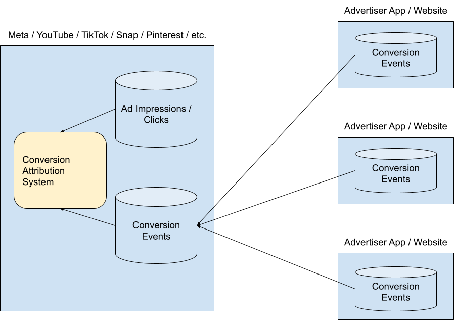
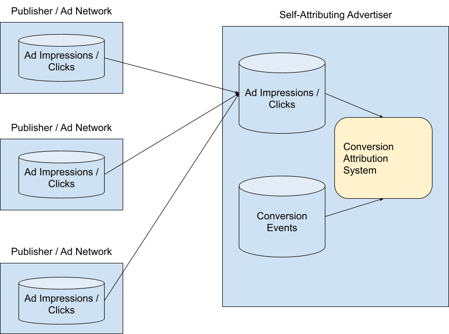
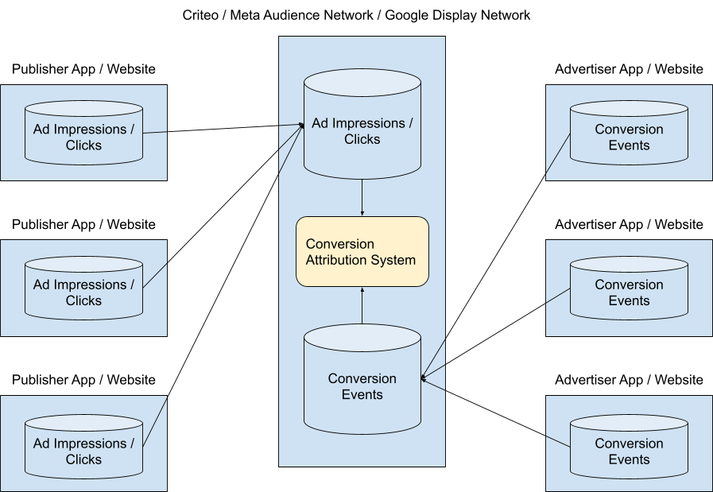
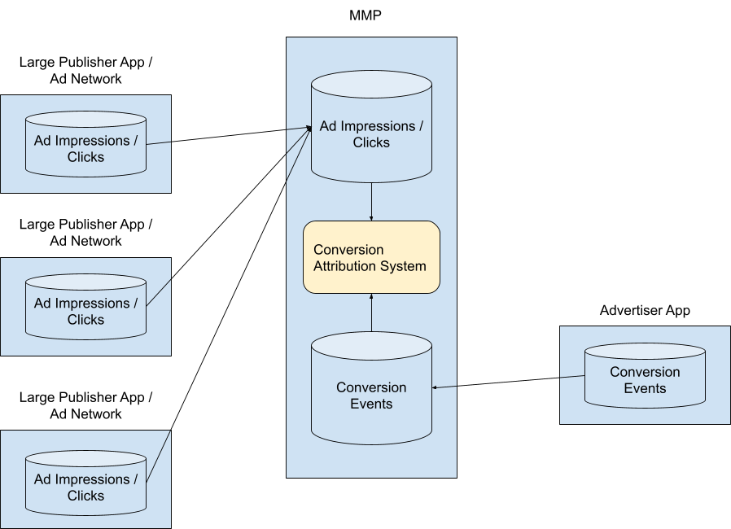
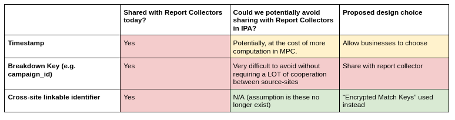
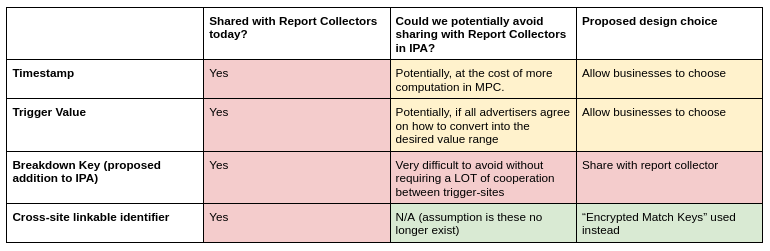
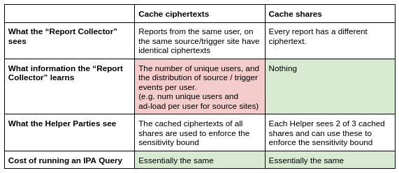

# What is a "Report Collector"? And what data can be shared with them?

To perform a conversion attribution query, we need a batch of both source **_and_** trigger events. A “report collector” is the entity that collects them both and makes queries.  In this document first we look at current examples of Report Collectors in ad tech and second within IPA we look at how we’ve made decisions about what information can or cannot be shared with Report Collectors.

# Current examples of “Report Collector”s

In the current world (with 3rd party cookies) there are analogous entities, who collect source and trigger events and then perform conversion attribution, in-the-clear, without any kind of “private computation” environment. A few examples:

* Self-Attributing Publishers
    * Meta
    * Google Search
    * YouTube
    * TikTok
    * Pinterest
    * Snap
    * More…
* Self-Attributing Advertisers
    * Amazon
    * More…
* Ad Networks
    * Criteo
    * Google Display Network
    * Meta Audience Network
    * More…
* MMPs
    * AppsFlyer
    * Adjust
    * Branch
    * Kochava
    * Singular
    * More…

## Self-Attributing Publishers

There are multiple large publishers who run their own ads (without the aid of a 3rd party ad network). These large publishers tend to perform conversion attribution themselves, after ingesting conversion data from advertisers who pay for ads on their platforms.

To assist with the ingestion of conversion data, these publishers may provide “pixels” and “App SDKs” that advertisers can use to send data about conversion events to them.

## Self-Attributing Advertisers

Some advertisers are large enough to perform their own ad-measurement in-house. They can request that publishers from whom they buy ads send them data about the ad impressions / clicks they paid for. Once they have this information, they can join it with the conversion data they generate themselves, and perform conversion attribution.

## Ad Networks

Ad Networks also collect data about ad impressions / clicks and conversion events together in order to perform conversion attribution queries. As ads are shown across a large network of publisher apps / websites, these report collectors must receive both types of data from 3rd parties.

## MMPs

“Mobile Measurement Partners” or MMPs are another example of a current “Report Collector”. They help advertisers perform conversion attribution queries across multiple publishers / ad-networks, and have the ability to perform cross-publisher attribution (including multi-touch attribution).

# “Report Collector” in the IPA proposal

In the IPA proposal, any and all of the above would all be examples of “Report Collectors”. We refer to ad impressions and clicks as “Source Events”, and ad conversion events as “Trigger Events”. We envision all of these entities continuing to collect data about these events similarly to how they do today. The primary changes being proposed are:

1. Source and Trigger events would no longer have user-level cross-site identifiers attached to them (like 3rd party cookies) that would allow a “Report Collector” to perform conversion attribution themselves.
2. The yellow box in each diagram labeled “Conversion Attribution System” would be replaced with an MPC operated by 3 helper parties that performs the IPA protocol.

The effect of these changes would be to ensure user-level cross-site information is no longer linkable by the “Report Collector”, who would instead receive only differentially private outputs.

# Data-minimization in the IPA design

As the above examples illustrate, publishers and advertisers are _currently sharing many types of information_ with “Report Collectors”. While it would be simple to assume they continue to do so (with the exception of user-level identifiers, which we envision being replaced with “encrypted match keys”) we think there is an opportunity to reduce the level of information sharing.

Viewed strictly through the lens of our privacy threat model of preventing cross-site tracking, none of this data sharing is problematic as it does not give sites new information they can use for user-level cross-site tracking. Furthermore, we assume the source site and trigger site might both be malicious and colluding. From this perspective, there is nothing that could be done to stop sites from sharing this type of information with one another.

But our recommendation is to approach this through the lens of “data minimization”, and for each attribute of a source or trigger event, analyze the possibility of hiding it from the Report Collector (by virtue of first secret-sharing it and then encrypting the shares towards the helpers prior to sending this data to the “Report Collector”). For some attributes this is possible, and for others it requires more challenging coordination or comes at an increased cost to the MPC.

Where there is a tradeoff between reduced data-sharing and increased MPC cost, our philosophy is to enable both approaches and let the entities (source and trigger sites and the report collector) decide for themselves if they’re willing to pay this increased cost.

## Source Event attributes

## Trigger Event attributes

## Hiding the source / trigger timestamps from the Report Collector

To supply more detail on the tradeoffs around how timestamp is shared, if source / trigger sites do not mind the “Report Collector” observing the timestamps associated with the source / trigger events they generate, then a lot of MPC processing can be saved, by just asking the Report Collector to simply sort the events by timestamp (in the clear) before sending the events to the helper party network. This will translate into a lower cost IPA query.

On the other hand, if timestamp information is hidden from the Report Collector, the MPC will need to sort first by match_key and then by timestamp. We do not have a detailed analysis of exactly how much more expensive such an MPC query would be, but are happy to furnish such an analysis in the future once we have measured it.

In principle though, we are happy to support both modes, and let businesses make this tradeoff on their own.

## Hiding “trigger values” from the Report Collector

The IPA protocol involves mapping “trigger values” onto small integers. These integers are closely related to the value chosen for the “per user cap” parameter.

In the event that multiple trigger sites are all sending trigger reports to a common Report Collector, this might pose a coordination challenge.

* All need to agree on the range of values to be mapped to
* All need to agree on how this mapping is performed

A coordination failure could lead to unexpected and erroneous results.

This level of coordination might be possible if all of the trigger sites are using a common piece of code to perform this translation (i.e. a “pixel”, which is just a piece of JavaScript code).

In principle, this seems like an area where it’s best to let businesses choose for themselves how to approach this challenge.

## Hiding source / trigger “breakdown keys” from the Report Collector

The way the “Aggregation” step of the IPA protocol works assumes that the values of “breakdown_key” are sequential integers starting at 0. The query parameter “max breakdown key” is assumed to be one more than the value of the maximum breakdown key.

To convert values like “campaign_id” into sequential integers starting at 0 would require a high degree of coordination between the source-sites which in practice will likely be very difficult to achieve.

Given that one of the main advantages of IPA is the ability to perform flexible queries, a Report Collector that is unaware of the values of the “breakdown key” would be hamstrung in its ability to map a set of inputs into multiple different queries, broken down in various ways.

In principle, it seems more pragmatic for source sites to share information related to breakdowns with the Report Collector (e.g. the campaign_id).

# Data minimization where there is no tradeoff

At times, we may encounter design decisions which reduce data-sharing with the Report Collector, and which do not come with any associated tradeoff (like coordination complexity, or MPC cost). In such situations, we think it best to just go with the design that minimizes data sharing with the Report Collector.

One example of a time where we encountered such a situation was in the design of the “encrypted match key”.

In order to support horizontal sharding of IPA queries containing extremely large numbers of reports, the encrypted_match_key will need to somehow enable the helpers to perform some kind of per-user sensitivity bounding.  Bounding the sensitivity is done by the helper parties and requires that they see a consistent value for matchkeys which were generated by the same user agent on the same site. We considered two approaches for getting this consistent value:

1. Having the user-agent cache the **_ciphertexts_** for the matchkeys per site
2. Having the user-agent cache the **_shares_** of the matchkey per site.

Given there isn’t an increase in cost, we went with the design that hides more information from the Report Collector.

Just in case it’s not clear, here is an example to explain what we mean by “cache shares”:

